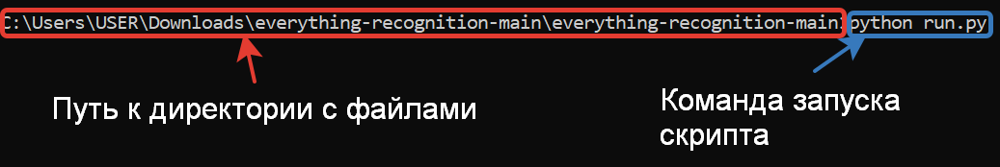

# everything-recognition
Скрипт позволяет идентифицировать различные объекты на предоставленном веб-камерой изображении.

## Как установить

Python3 должен быть уже установлен. 
Затем используйте `pip` (или `pip3`, есть есть конфликт с Python2) для установки зависимостей:
```
pip install -r requirements.txt
```

## Запуск и результат работы

Запустить скрипт можно следующим образом:


Результат работы скрипта представлен ниже:

